# Компилятор

#### [Лабораторная работа №1: Разработка пользовательского интерфейса (GUI) для языкового процессора](#lab1)
#### [Лабораторная работа №2: Разработка лексического анализатора (сканера)](#lab2)
#### [Лабораторная работа №3: Разработка синтаксического анализатора (парсера)](#lab3)
#### [Лабораторная работа №4: Нейтрализация ошибок (метод Айронса)](#lab4)
 
<a id="lab1"></a>
## Лабораторная работа №1: Разработка пользовательского интерфейса (GUI) для языкового процессора
**Тема:** разработка текстового редактора с возможностью дальнейшего расширения функционала до языкового процессора.

**Цель работы:** разработать приложение с графическим интерфейсом пользователя, способное редактировать текстовые данные. Это приложение будет базой для будущего расширения функционала в виде языкового процессора.

**Язык реализации:** C#, WPF.

### Интерфейс текстового редактора

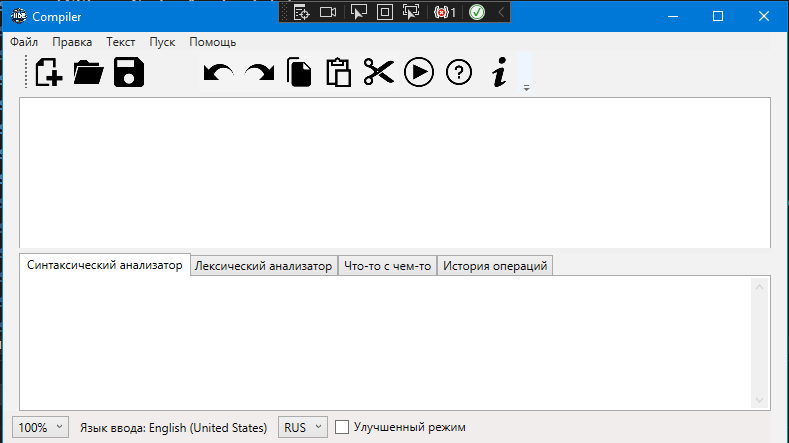

#### Получившийся текстовый редактор имеет следующие элементы:
1. Заголовок окна.

   Содержит информацию о названии открытого файла, полного пути к нему, а также о том, сохранен ли он на текущий момент (наличие символа звездочки справа от названия означает наличие несохраненных изменений).
3. Меню
   | Пункт меню | Подпункты |
   | ------ | ------ |
   | Файл | 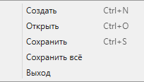 |
   | Правка | 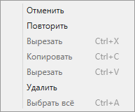 |
   | Текст | 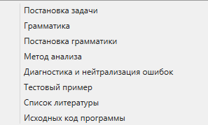 |
   | Пуск |  |
   | Справка | 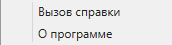|
4. Панель инструментов
   
   

   - Создать
   - Открыть
   - Сохранить
   - Изменить размер текста
   - Отменить
   - Повторить
   - Копировать
   - Вырезать
   - Вставить
   - Пуск
   - Помощь
   - О программе
5. Область редактирования
   
   Поддерживаются следующие функции:
   - Изменение размера текста
   - Открытие файла при перетаскивании его в окно программы
   - Базовая подсветка синтаксиса
   - Нумерация строк
7. Область отображения результатов

   В область отображения результатов выводятся сообщения и результаты работы языкового процессора.

   Поддерживаются следующие функции:
   - Изменение размера текста
   - Отображение ошибок в виде таблицы
### Справочная система

- #### Главное окно:
    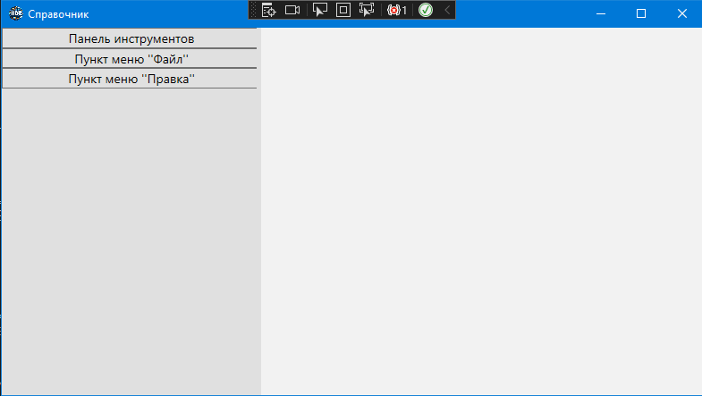
- #### Панель инструментов:
    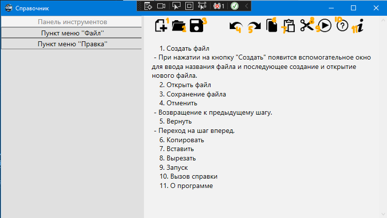
- #### Пункт меню "Файл":
    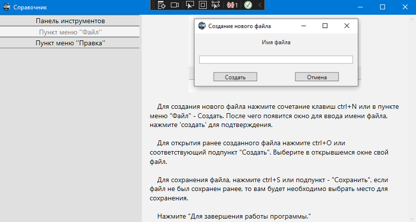
- #### Пункт меню "Правка:
    

<b id="lab2"></b>
## Лабораторная работа №2: Разработка лексического анализатора (сканера)

**Тема:** разработка лексического анализатора (сканера).

**Цель работы:** изучить назначение лексического анализатора. Спроектировать алгоритм и выполнить программную реализацию сканера.

| № | Тема | Пример верной строки | Справка |
| ------ | ------ | ------ | ------ |
| 33 | Объявление и инициализация строковой константы на языке Java | final String str = "Hello World"; | [ссылка](https://bito.ai/resources/java-constant-string-java-explained/#2) |

**В соответствии с вариантом задания необходимо:**

1. Спроектировать диаграмму состояний сканера.
2. Разработать лексический анализатор, позволяющий выделить в тексте лексемы, иные символы считать недопустимыми (выводить ошибку).
3. Встроить сканер в ранее разработанный интерфейс текстового редактора. Учесть, что текст для разбора может состоять из множества строк.

**Входные данные:** строка (текст программного кода).

**Выходные данные:** последовательность условных кодов, описывающих структуру разбираемого текста с указанием места положения и типа.

### Примеры допустимых строк

```Java
final String str1 = zzz"Java"vvv;
```

```Java
final  dfdf String str2 = "Vsfok" ываыа ; final fdfdfd String sfsdf str1 dfsf input=dddd zzz"Java"vvv;zxcdf
```

```Java
final dsdsds String input = "Java";zxcdf final fdfdfd String str1 = fff"Java"lll;
```

```Java
final String str2 = "Java"; final String str1 = "C#";
```


### Диаграмма состояний сканера

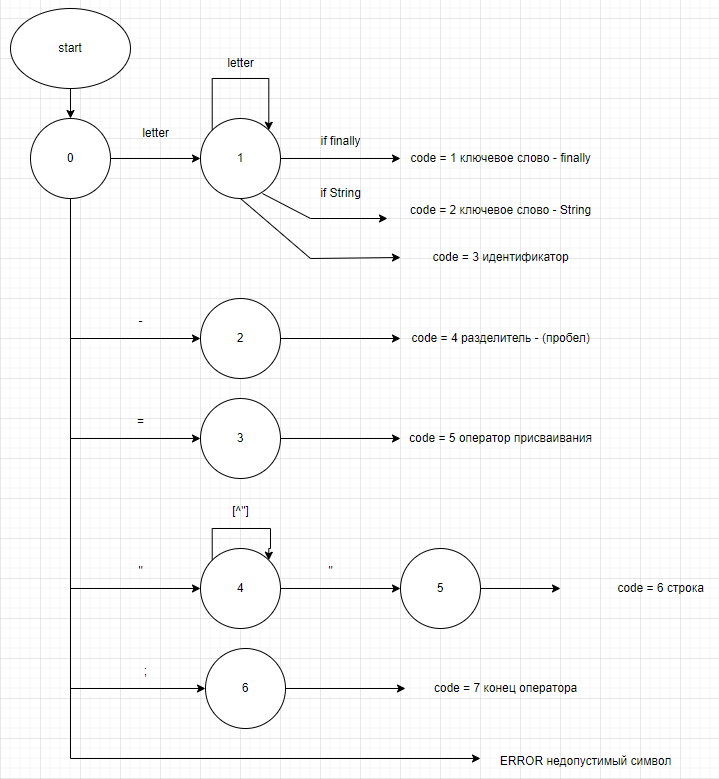

### Тестовые примеры

 **Тест:** Пример, показывающий все возможные лексемы, которые могут быть найдены лексическим анализатором.
   
   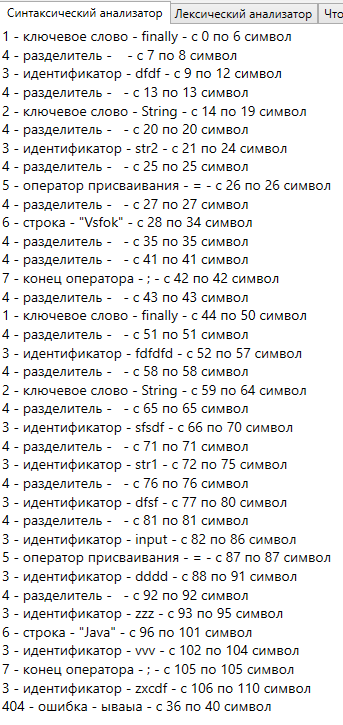

<c id="lab3"></c>
## Лабораторная работа №3: Разработка синтаксического анализатора (парсера)

**Тема:** разработка синтаксического анализатора (парсера).

**Цель работы:** изучить назначение синтаксического анализатора, спроектировать алгоритм и выполнить программную реализацию парсера.

| № | Тема | Пример верной строки | Справка |
| ------ | ------ | ------ | ------ |
| 33 | Объявление и инициализация строковой константы на языке Java | final String str = "Hello World"; | [ссылка](https://bito.ai/resources/java-constant-string-java-explained/#2) |

**В соответствии с вариантом задания на курсовую работу необходимо:**
1. Разработать автоматную грамматику.
2. Спроектировать граф конечного автомата (перейти от автоматной грамматики к конечному автомату).
3. Выполнить программную реализацию алгоритма работы конечного автомата.
4. Встроить разработанную программу в интерфейс текстового редактора, созданного на первой лабораторной работе.

### Грамматика

G[<СК> = <строковая константа>]:

VT = { ‘final’, ‘String’, ‘a’…’z’, ‘A’…’Z’, ‘0’…’9’, ‘:’, ‘;’, ‘+’, ‘-‘, ‘=’, ‘_’,  ‘"’}

VN = { <СК>, STR, ID, ASSIGN, ROW, END, Letter , Digit, Symbols}

P = {

<СК> → ‘final’ STR
STR →  ‘String’ ID
ID → Letter  { Letter  | Digit  | ‘_’ } ASSIGN 
ASSIGN → ‘=’ ROW
ROW → ‘"’ {Symbols} ‘"’ END
END → ‘;’
Letter → ‘a’ | ‘b’ | … | ‘z’ | ‘A’ | ‘B’ | … | ‘Z’
Digit → ‘0’ | ‘1’ | … | ‘9’
Symbols → Letter|Digit|‘+’| ‘-‘|‘=’|'~'|'@'| '#'|'$'|'&'...
}

### Классификация грамматики

   Согласно классификации Хомского, грамматика G[<СК>] является полностью автоматной.

### Граф конечного автомата

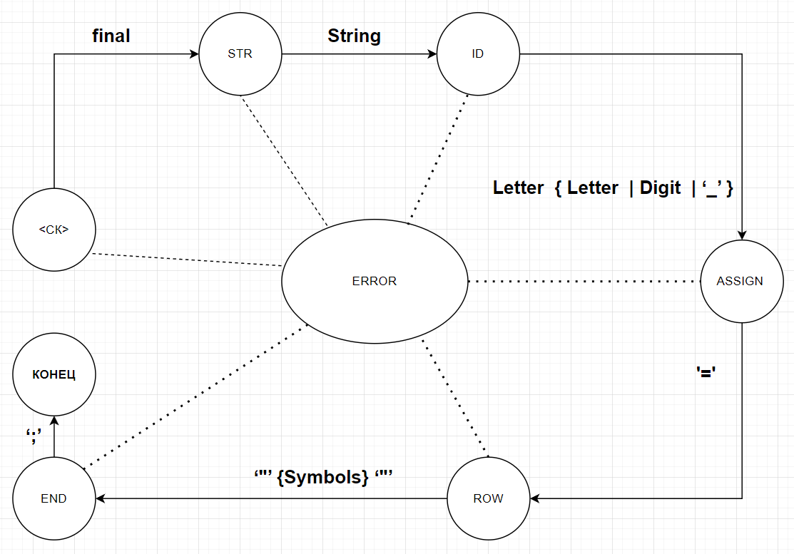

### Тестовые примеры

1. **Тест №1.** Все выражения написаны корректно.
   
   
2. **Тест №2.** Пример ошибок.
  
   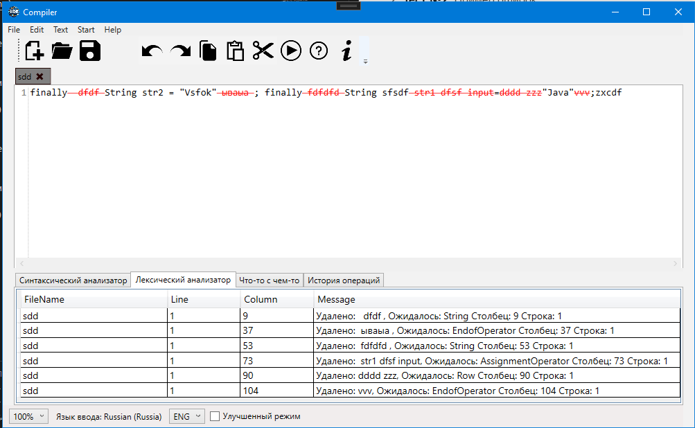

<d id="lab4"></d>
## Лабораторная работа №4: Нейтрализация ошибок (метод Айронса)

**Тема**: нейтрализация ошибок (метод Айронса).

**Цель работы:** реализовать алгоритм нейтрализации синтаксических ошибок и дополнить им программную реализацию парсера.

### Метод Айронса

Разрабатываемый синтаксический анализатор построен на базе автоматной грамматики. При нахождении лексемы, которая не соответствует грамматике предлагается свести алгоритм нейтрализации к последовательному
удалению следующего символа во входной цепочке до тех пор, пока следующий символ не окажется одним из допустимых в данный момент разбора.

### Реализация пункта меню "Текст"
Нажатие на подпункты меню "__Текст__" ведут пользователя на страницу ветки моего GitHub с проектом. __Временное решение__
### Тестовые примеры

1. **Тест №1.** Пример ошибок.
    Входные данные:
    ``` Java
    final dsdsds String input = "Java";
    zxcdf final fdfdfd String str1 = zzz"Java"vvv;
    ```
    Выходные данные:
   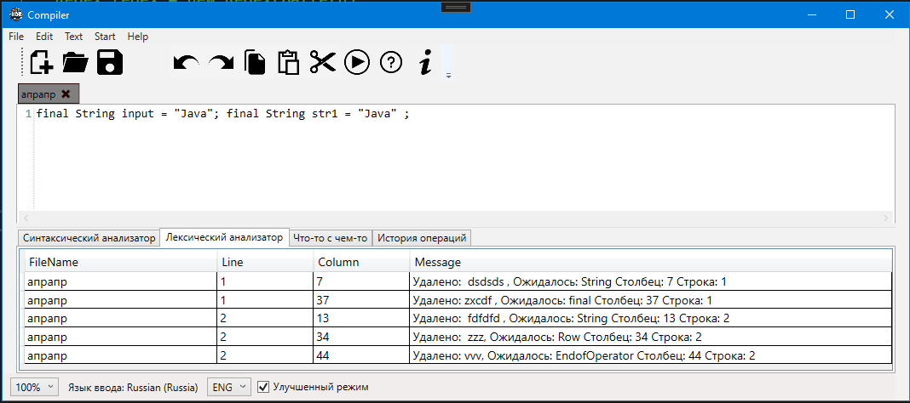
2. **Тест №2.** Пример ошибок.

   Входные данные:
    ``` Java
    final  
    dfdf 
    String 
    str2 = "Vsfok" 
    ываыа ; final f
    dfdfd String 
    sfsdf str1 dfsf 
    input=dddd z
    zz"Java"vvv;zxcdf
    final dsds
    ds String in
    put = "Java";zx
    cdf final fdfd
    fd String str1 = zzz
    "Java"vvv
    ;
    ```
    Выходные данные:
   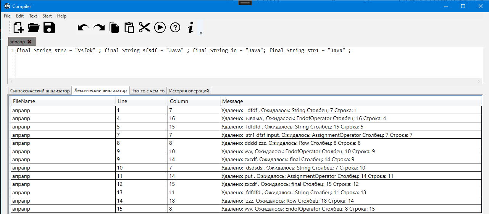
***


